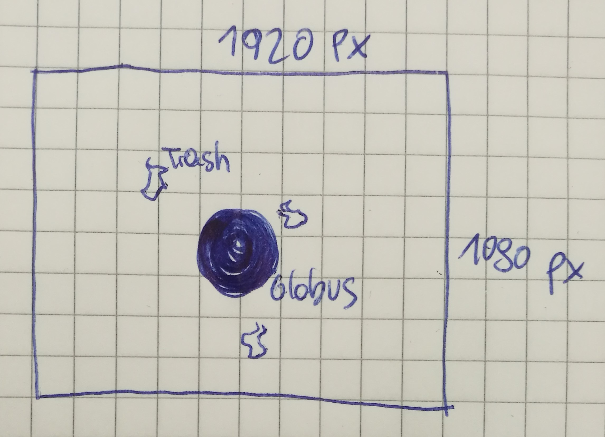
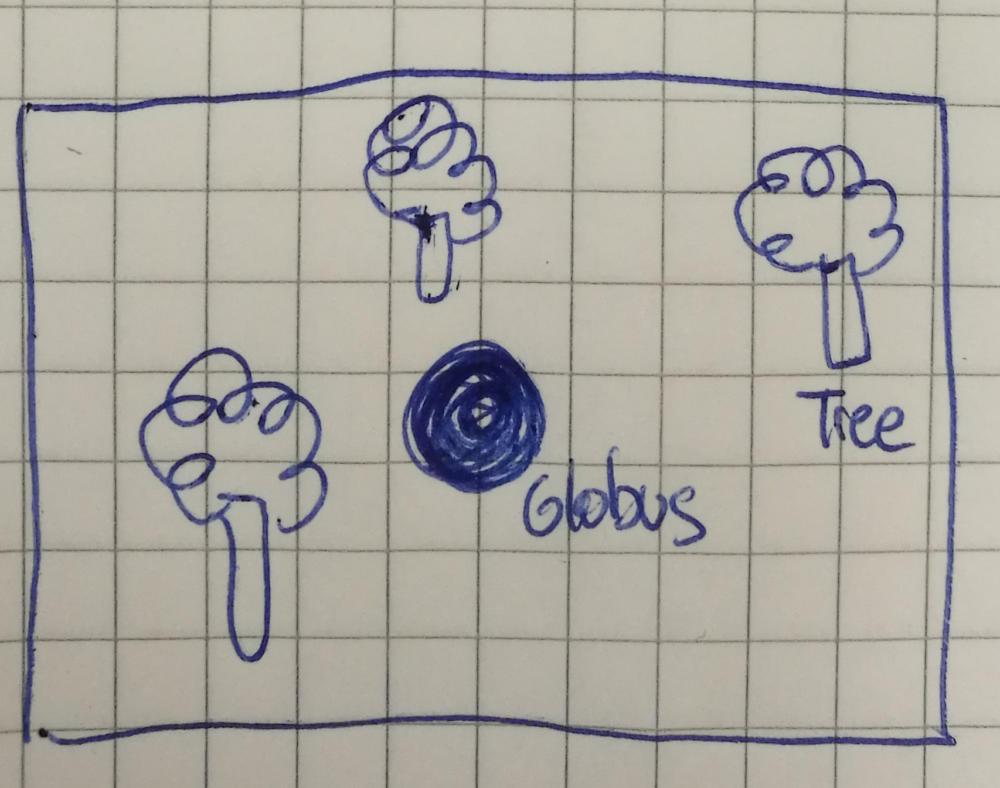
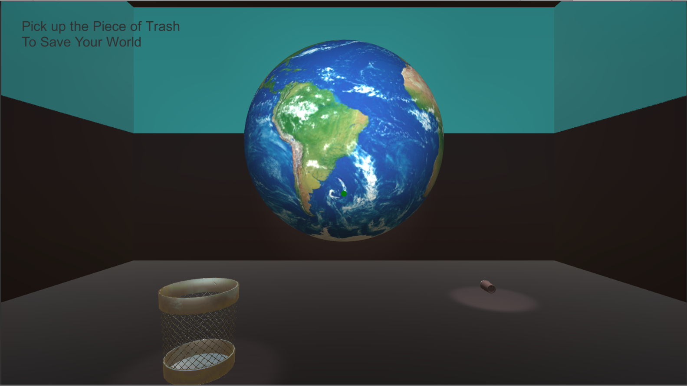

# Save Your World! VR

## Concept
A 3D globe is in the middle of a room. The player has to pick up trash, laying around the globe. If he picks up a piece of trash, a tree appears in the room. The player has to repeat this step three times. Then the globe spins, the game ends and the world is saved of climate change. 
  
### Controls
#### Movement
Press the Button and look in the Direction you want to go.
#### Mechanics
+ Press the Button while looking at an Object to pick it up.
+ Press the Button to Release the Object.

## Dev-Platform
 + Windows 10 64 bit 
 + Unity3D 2019.1.14f
 + API Compatibility Level .NET Standart 2.0
 + Scripting Runtime Version .NET 4.x Equivalent
 + Visual Studio Community 2019 16.4.2
 
## Target-Platfrom
 + Android
 + Mobile
 + 1920 x 1080 px

## Status
70%

## Gameplay Screenshots
### Pick up Trash

### Grow Trees

### Game Play

## Lessons Learned
+ How to Setup Unity for VR Games (SDK Download,..)
+ How to Walk in VR 
+ How to Interact with Objects (Pick up)
+ First Time using the Unity Asset Store

## Limitations
+ You can not exactly define where you release the cup. It automatically appears in the trash bin as soon as you start walking and press the button. 
+ There is only one cup implemented by now. The Game has no end.

## Resources used
+ Earth 3D Model: https://assetstore.unity.com/packages/3d/environments/sci-fi/planet-earth-free-23399
+ Tree 3D Model: https://assetstore.unity.com/packages/3d/vegetation/trees/realistic-tree-9-rainbow-tree-54622
+ Trash Bin 3D Model: https://assetstore.unity.com/packages/3d/props/furniture/trash-bin-96670
+ Plastic Cup 3D Model: https://free3d.com/3d-model/plastic-cup-high-poly-version-79161.html

+ Grab/release object for Google cardboard Tutorial: https://www.youtube.com/watch?v=wWSYT-Yrr9E
+ Basic Setup Google Cardboard Tutorial: https://www.youtube.com/watch?v=OEP7sMwfZnE&list=PLiuDBLn1FK-QOmpA3Vs2JY0DVAj0GfFPn
+ Player Movement Tutorial: https://www.youtube.com/watch?v=Qgpb5QzhuOg&list=PLiuDBLn1FK-QOmpA3Vs2JY0DVAj0GfFPn&index=2
+ Basic Google Cardboard Unity Starting Tutorial 1: https://developers.google.com/vr/develop/android/get-started
+ Basic Google Cardboard Unity Starting Tutorial 2: https://docs.unity3d.com/Manual/android-sdksetup.html 

## Documentation Of The Project
You can find the whole documentation of SAVEYOURWORLD! in this project folder. [CLICK HERE](SAVEYOURWORLD_Dokumentation.pdf)
**Copyright by Clea Eliasch**